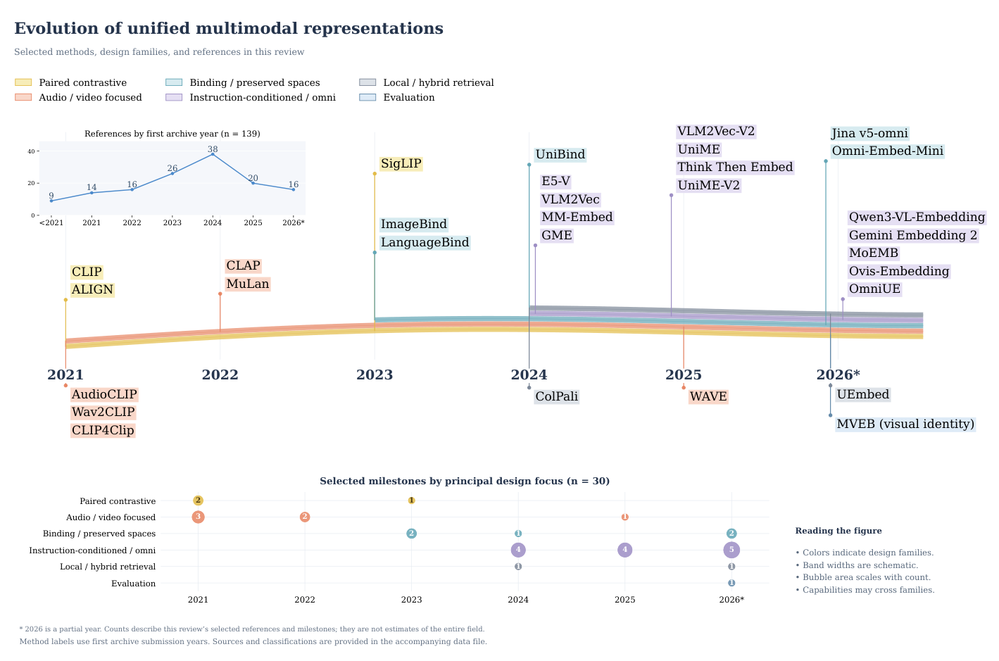
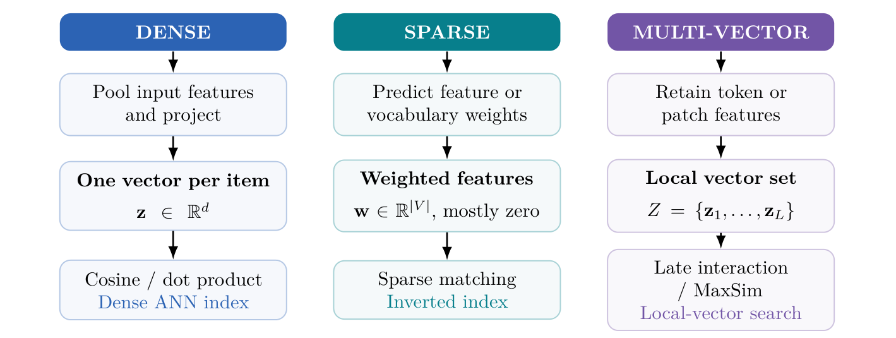
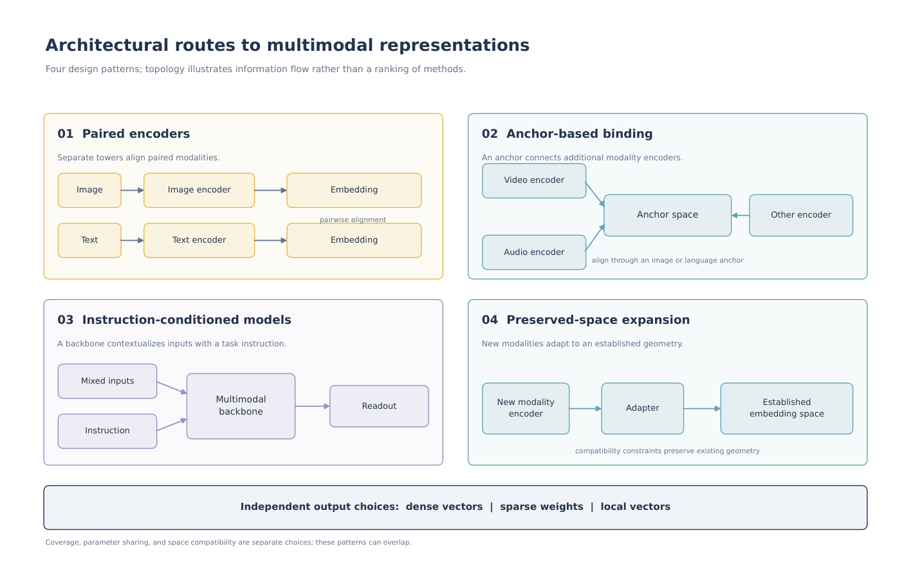
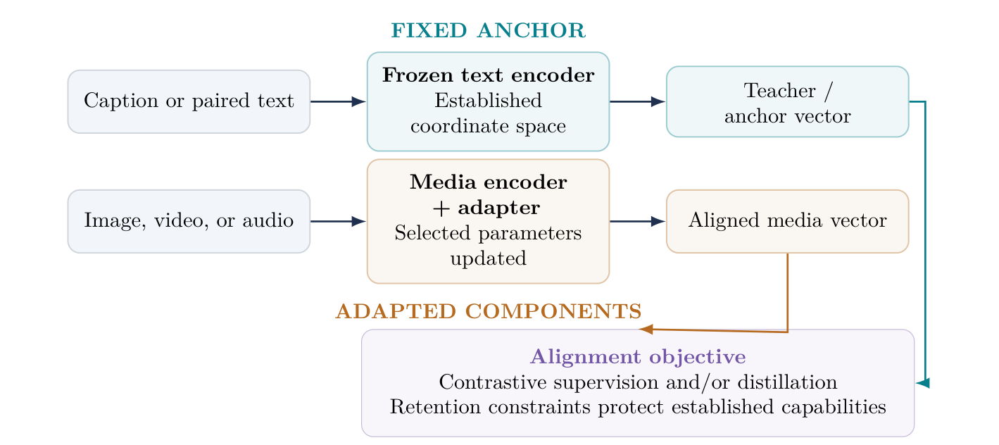
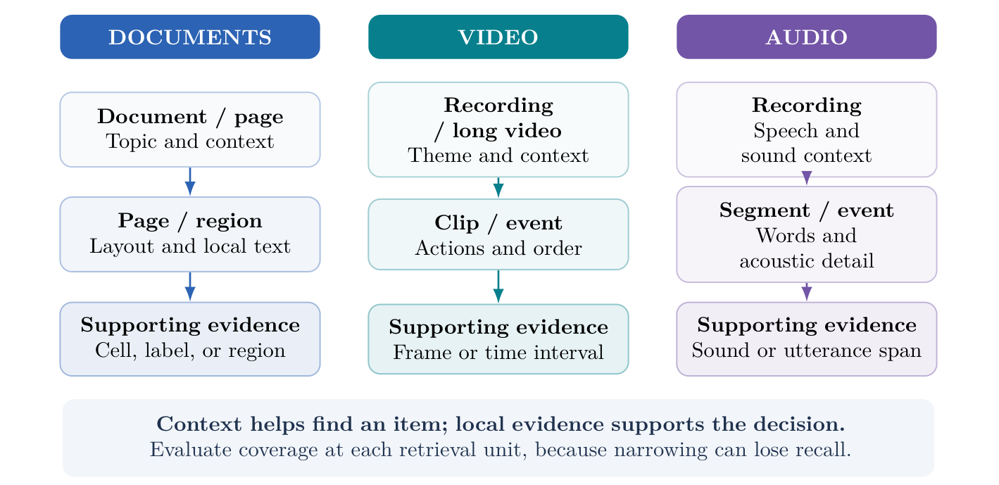
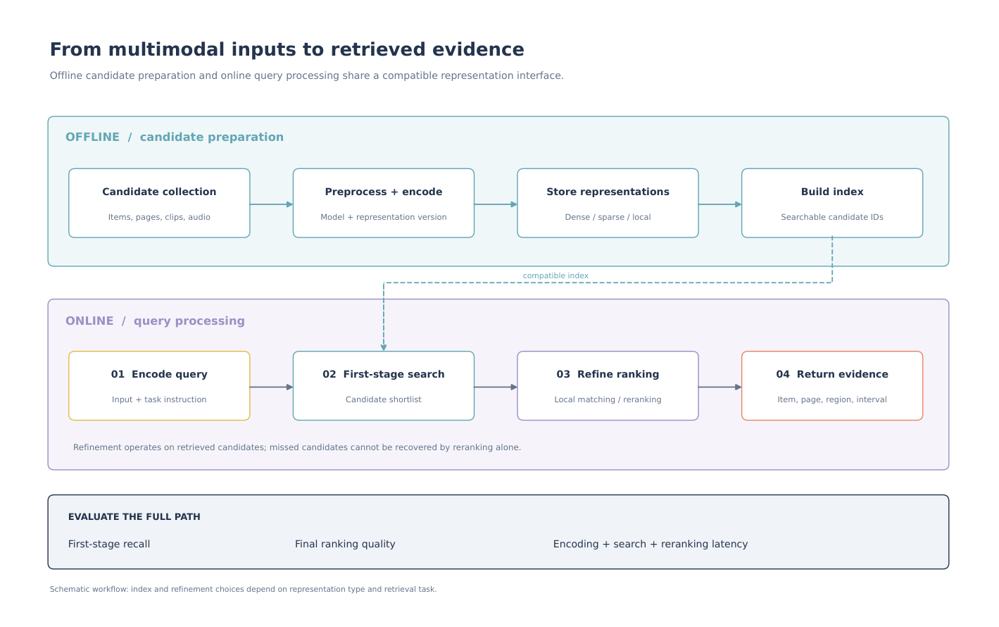

# Unified Multimodal Representation Learning: Architectures, Alignment, and Retrieval

**2026 · Preprint · Zenodo**

[Read the PDF](Unified_Multimodal_Representation_Learning.pdf) · [View on Zenodo](https://zenodo.org/records/23227885) · [DOI: 10.5281/zenodo.23227885](https://doi.org/10.5281/zenodo.23227885)

## Contents

- [Abstract](#abstract)
- [Topics covered](#topics-covered)
- [Related work: FOCUS](#related-work-long-video-frame-selection)
- [Figures](#figures)
- [Citation](#citation)
- [References](#references)

## Abstract

A shared embedding space offers a simple interface to heterogeneous data: encode text, images, video, or audio once, then retrieve relevant items by comparing representations. The difficulty is deciding what those representations should preserve. Semantic similarity, exact identity, temporal order, and evidence support impose different requirements, even when the inputs are identical. This review traces the development of multimodal embeddings from paired image–text encoders to modality binding, instruction-conditioned backbones, and omni-modal retrieval. We organize the methods by input coverage, relevance conditioning, representation granularity, alignment strategy, and deployment compatibility. The discussion connects training objectives and data construction to the specific demands of visual documents, long video, speech, environmental sound, and music. Selected quantitative comparisons retain their original benchmark versions, metrics, and retrieval directions, revealing differences that aggregate scores can obscure. Recent studies on sparse–dense outputs, visual identity, interactive queries, and frozen-space expansion further broaden the design space. We conclude that progress toward general-purpose multimodal representations depends on preserving the right evidence for each task while keeping encoding, indexing, and model updates affordable. Relation-specific evaluation, capability retention, and tests against deployed indexes are central to that goal.

## Topics covered

- Multimodal embeddings for text, images, video, and audio.
- Input coverage, relevance conditioning, representation granularity, and alignment strategies.
- Retrieval for visual documents, long video, speech, environmental sound, and music.
- Sparse–dense outputs, visual identity, interactive queries, and frozen-space expansion.
- Evaluation, capability retention, and compatibility with deployed indexes.

## Related work: long-video frame selection

FOCUS studies query-relevant keyframe selection under a limited visual-token budget, complementing the review’s discussion of temporal evidence and video representation granularity.

**Citation:** Zhu, Z., Xu, H., Luo, Y., Liu, Y., Sarkar, K., Yang, Z., & You, Y. (2025). *FOCUS: Efficient Keyframe Selection for Long Video Understanding*. arXiv. https://doi.org/10.48550/arXiv.2510.27280

[Paper](https://arxiv.org/abs/2510.27280) · [PDF](https://arxiv.org/pdf/2510.27280) · [ICLR / OpenReview](https://openreview.net/forum?id=1OQKqLFcbB) · [Code](https://github.com/NUS-HPC-AI-Lab/FOCUS)

## Figures

All six figures from the paper are shown below. Click a figure to view it at full resolution.

### Figure 1: Evolution of multimodal representations

Figure 1: Selected milestones in multimodal representation learning, grouped by first archive submission and principal design focus. The upper-left panel counts the 139 references in this review; bubble areas count the 30 selected milestones. Colored ribbons identify design families schematically and do not measure prevalence or performance. The 2026 counts are partial. Methods may span several families; the grouping does not imply architectural ancestry.

### Figure 2: Dense, sparse, and multi-vector retrieval

Figure 2: Representation choices determine the retrieval interface. Dense pooling compresses evidence into one vector, sparse outputs expose weighted features, and local vectors defer interaction until scoring. ColBERT and ColPali use local interaction; STAIR and UEmbed explore sparse or sparse–dense representations [20](#ref-20), [23](#ref-23), [24](#ref-24), [25](#ref-25).

### Figure 3: Architectural routes

Figure 3: Four architectural routes to reusable multimodal representations. Parameter sharing, modality coverage, and metric-space compatibility are separate design choices. Each route can be combined with different output granularities.

### Figure 4: Expanding a frozen embedding space

Figure 4: Expanding a frozen embedding space. Text supplies an anchor while selected media components learn compatible outputs. Jina v5-omni and Omni-Embed-Mini instantiate different versions of this preservation-oriented strategy [13](#ref-13), [66](#ref-66). Teal indicates fixed components; amber indicates components selected for adaptation.

### Figure 5: Retrieval units across modalities

Figure 5: Retrieval units across modalities. Coarse representations capture context, while finer units retain the evidence required by a query. MMDocIR, LoVR, and MSEB illustrate the need for document, temporal, and acoustic evaluation at appropriate granularities [94](#ref-94), [96](#ref-96), [97](#ref-97).

### Figure 6: From inputs to retrieved evidence

Figure 6: A multimodal retrieval pipeline separates offline candidate encoding from online query processing. Later interaction improves ranking only among retrieved candidates, so first-stage recall and end-to-end cost remain essential evaluation quantities.

## Citation

Kanchan, S., Jana, E., & Agrawal, D. (2026). Unified Multimodal Representation Learning: Architectures, Alignment, and Retrieval. Zenodo. https://doi.org/10.5281/zenodo.23227885

## References

The complete bibliography contains **139 references**. Numbering and archive versions follow the PDF; each entry links to its source.

### References 1–25

**[1]** Alec Radford, Jong Wook Kim, Chris Hallacy, Aditya Ramesh, Gabriel Goh, Sandhini Agarwal, Girish Sastry, Amanda Askell, Pamela Mishkin, Jack Clark, Gretchen Krueger, and Ilya Sutskever. Learning Transferable Visual Models From Natural Language Supervision, 2021. [Read source ↗](https://arxiv.org/abs/2103.00020v1)

**[2]** Chao Jia, Yinfei Yang, Ye Xia, Yi-Ting Chen, Zarana Parekh, Hieu Pham, Quoc V. Le, Yunhsuan Sung, Zhen Li, and Tom Duerig. Scaling Up Visual and Vision-Language Representation Learning With Noisy Text Supervision, 2021. [Read source ↗](https://arxiv.org/abs/2102.05918v2)

**[3]** Rohit Girdhar, Alaaeldin El-Nouby, Zhuang Liu, Mannat Singh, Kalyan Vasudev Alwala, Armand Joulin, and Ishan Misra. ImageBind: One Embedding Space To Bind Them All, 2023. [Read source ↗](https://arxiv.org/abs/2305.05665v2)

**[4]** Bin Zhu, Bin Lin, Munan Ning, Yang Yan, Jiaxi Cui, HongFa Wang, Yatian Pang, Wenhao Jiang, Junwu Zhang, Zongwei Li, Wancai Zhang, Zhifeng Li, Wei Liu, and Li Yuan. LanguageBind: Extending Video-Language Pretraining to N-modality by Language-based Semantic Alignment, 2023. [Read source ↗](https://arxiv.org/abs/2310.01852v7)

**[5]** Hongjin Su, Weijia Shi, Jungo Kasai, Yizhong Wang, Yushi Hu, Mari Ostendorf, Wen-tau Yih, Noah A. Smith, Luke Zettlemoyer, and Tao Yu. One Embedder, Any Task: Instruction- Finetuned Text Embeddings, 2022. [Read source ↗](https://arxiv.org/abs/2212.09741v3)

**[6]** Orion Weller, Benjamin Van Durme, Dawn Lawrie, Ashwin Paranjape, Yuhao Zhang, and Jack Hessel. Promptriever: Instruction- Trained Retrievers Can Be Prompted Like Language Models, 2024. [Read source ↗](https://arxiv.org/abs/2409.11136v1)

**[7]** Ting Jiang, Minghui Song, Zihan Zhang, Haizhen Huang, Weiwei Deng, Feng Sun, Qi Zhang, Deqing Wang, and Fuzhen Zhuang. E5-V: Universal Embeddings with Multimodal Large Language Models, 2024. [Read source ↗](https://arxiv.org/abs/2407.12580v1)

**[8]** Ziyan Jiang, Rui Meng, Xinyi Yang, Semih Yavuz, Yingbo Zhou, and Wenhu Chen. VLM2Vec: Training Vision-Language Models for Massive Multimodal Embedding Tasks, 2024. [Read source ↗](https://arxiv.org/abs/2410.05160v3)

**[9]** Sheng-Chieh Lin, Chankyu Lee, Mohammad Shoeybi, Jimmy Lin, Bryan Catanzaro, and Wei Ping. MM-Embed: Universal Multimodal Retrieval with Multimodal LLMs, 2024. [Read source ↗](https://arxiv.org/abs/2411.02571v2)

**[10]** Xin Zhang, Yanzhao Zhang, Wen Xie, Mingxin Li, Ziqi Dai, Dingkun Long, Pengjun Xie, Meishan Zhang, Wenjie Li, and Min Zhang. GME: Improving Universal Multimodal Retrieval by Multimodal LLMs, 2024. [Read source ↗](https://arxiv.org/abs/2412.16855v2)

**[11]** Rui Meng, Ziyan Jiang, Ye Liu, Mingyi Su, Xinyi Yang, Yuepeng Fu, Can Qin, Zeyuan Chen, Ran Xu, Caiming Xiong, Yingbo Zhou, Wenhu Chen, and Semih Yavuz. VLM2Vec-V2: Advancing Multimodal Embedding for Videos, Images, and Visual Documents, 2025. [Read source ↗](https://arxiv.org/abs/2507.04590v1)

**[12]** Changli Tang, Qinfan Xiao, Ke Mei, Tianyi Wang, Fengyun Rao, and Chao Zhang. WAVE: Learning Unified & Versatile Audio-Visual Embeddings with Multimodal LLM, 2025. [Read source ↗](https://arxiv.org/abs/2509.21990v2)

**[13]** Florian Hönicke, Michael Günther, Andreas Koukounas, Mohammad Kalim Akram, Saba Sturua, and Han Xiao. jina-embeddings-v5omni: Geometry-preserving Embeddings via Locked Aligned Towers, 2026. [Read source ↗](https://arxiv.org/abs/2605.08384v4)

**[14]** Madhuri Shanbhogue, Zhe Li, Shanfeng Zhang, Gustavo Hernández Ábrego, Shih- Cheng Huang, Aashi Jain, Daniel Salz, Sonam Goenka, Chaitra Hegde, Ji Ma, Feiyang Chen, Jiaxing Wu, Tanmaya Dabral, Babak Samari, Kevin Poulet, Daniel Cer, Kaifeng Chen, Paul Suganathan, Hui Hui, Jovan Andonov, Philippe Schlattner, Jay Han, Iftekhar Naim, Wing Lowe, Vladimir Pchelin, Albert Yang, Yi- Ting Chen, Zhongli Ding, Grace Zhang, Georg Heigold, Yichang Chen, Antoine Reveillon, Brendan Mccloskey, Wenlei Zhou, Dahun Kim, Rui Meng, Emma Wang, Jack Zheng, Halley Fede, Zhen Yang, Keegan Mosley, Brian Potetz, Sahil Dua, Henrique Schechter Vera, Shen Gao, Hesen Zhang, Andreas Hess, Hengxuan Ying, Alberto Montes, Karan Gill, Min Choi, Sebastian Russo, Anja Hauth, Jinhyuk Lee, Michael Boratko, Megan Barnes, Vikram Rao, Claudiu Musat, Cyril Allauzen, Ehsan Variani, Shankar Kumar, Tom Bagby, Junyi Jiao, Yang Gu, Tengxin Li, Ayush Agrawal, Roberto Santana, Dev Nath, Stephen Karukas, Shuoxuan Han, Lucia Loher, Alice Twu, Nidhi Vyas, Siddharth Bhai, Frank Palma Gomez, Wangyuan Zhang, Chaoren Liu, Jizheng Yang, Steve Qiu, Shijie Zhang, Sujay Kulkarni, Sascha Rothe, Sean Nakamoto, Raphael Hoffmann, Zach Gleicher, Yunhsuan Sung, Qin Yin, Tom Duerig, and Mojtaba Seyedhosseini. Gemini Embedding 2: A Native Multimodal Embedding Model from Gemini, 2026. [Read source ↗](https://arxiv.org/abs/2605.27295v1)

**[15]** Tadas Baltrušaitis, Chaitanya Ahuja, and Louis-Philippe Morency. Multimodal Machine Learning: A Survey and Taxonomy, 2017. [Read source ↗](https://arxiv.org/abs/1705.09406v2)

**[16]** Muhammad Arslan Manzoor, Sarah Albarri, Ziting Xian, Zaiqiao Meng, Preslav Nakov, and Shangsong Liang. Multimodality Representation Learning: A Survey on Evolution, Pretraining and Its Applications, 2023. [Read source ↗](https://arxiv.org/abs/2302.00389v1)

**[17]** Charles Zhang, Benji Peng, Xintian Sun, Qian Niu, Junyu Liu, Keyu Chen, Ming Li, Pohsun Feng, Ziqian Bi, Ming Liu, Yichao Zhang, Xinyuan Song, Cheng Fei, Caitlyn Heqi Yin, Lawrence KQ Yan, Hongyang He, and Tianyang Wang. From Word Vectors to Multimodal Embeddings: Techniques, Applications, and Future Directions For Large Language Models, 2024. [Read source ↗](https://arxiv.org/abs/2411.05036v3)

**[18]** Jianglin Lu, Hailing Wang, Yi Xu, Yizhou Wang, Kuo Yang, and Yun Fu. Representation Potentials of Foundation Models for Multimodal Alignment: A Survey, 2025. [Read source ↗](https://arxiv.org/abs/2510.05184v1)

**[19]** Yibo Yan, Jiahao Huo, Guanbo Feng, Mingdong Ou, Yi Cao, Xin Zou, Shuliang Liu, Yuanhuiyi Lyu, Yu Huang, Jungang Li, Kening Zheng, Xu Zheng, Philip S. Yu, James Kwok, and Xuming Hu. Unlocking Multimodal Document Intelligence: From Current Triumphs to Future Frontiers of Visual Document Retrieval, 2026. [Read source ↗](https://arxiv.org/abs/2602.19961v3)

**[20]** Omar Khattab and Matei Zaharia. ColBERT: Efficient and Effective Passage Search via Contextualized Late Interaction over BERT, 2020. [Read source ↗](https://arxiv.org/abs/2004.12832v2)

**[21]** Keshav Santhanam, Omar Khattab, Jon Saad- Falcon, Christopher Potts, and Matei Zaharia. ColBERTv2: Effective and Efficient Retrieval via Lightweight Late Interaction, 2021. [Read source ↗](https://arxiv.org/abs/2112.01488v3)

**[22]** Keshav Santhanam, Omar Khattab, Christopher Potts, and Matei Zaharia. PLAID: An Efficient Engine for Late Interaction Retrieval, 2022. [Read source ↗](https://arxiv.org/abs/2205.09707v1)

**[23]** Manuel Faysse, Hugues Sibille, Tony Wu, Bilel Omrani, Gautier Viaud, Céline Hudelot, and Pierre Colombo. ColPali: Efficient Document Retrieval with Vision Language Models, 2024. [Read source ↗](https://arxiv.org/abs/2407.01449v6)

**[24]** Chen Chen, Bowen Zhang, Liangliang Cao, Jiguang Shen, Tom Gunter, Albin Madappally Jose, Alexander Toshev, Jonathon Shlens, Ruoming Pang, and Yinfei Yang. STAIR: Learning Sparse Text and Image Representation in Grounded Tokens, 2023. [Read source ↗](https://arxiv.org/abs/2301.13081v2)

**[25]** Tingyu Song, Mingxin Li, Yanzhao Zhang, Dingkun Long, Pengjun Xie, Zhijie Nie, Yilun Zhao, and Shu Wu. UEmbed: Unified Sparse and Dense Multimodal Embeddings, 2026. [Read source ↗](https://arxiv.org/abs/2608.02583v1)

### References 26–50

**[26]** Aaron van den Oord, Yazhe Li, and Oriol Vinyals. Representation Learning with Contrastive Predictive Coding, 2018. [Read source ↗](https://arxiv.org/abs/1807.03748v2)

**[27]** Christoph Schuhmann, Richard Vencu, Romain Beaumont, Robert Kaczmarczyk, Clayton Mullis, Aarush Katta, Theo Coombes, Jenia Jitsev, and Aran Komatsuzaki. LAION- 400M: Open Dataset of CLIP-Filtered 400 Million Image-Text Pairs, 2021. [Read source ↗](https://arxiv.org/abs/2111.02114v1)

**[28]** Christoph Schuhmann, Romain Beaumont, Richard Vencu, Cade Gordon, Ross Wightman, Mehdi Cherti, Theo Coombes, Aarush Katta, Clayton Mullis, Mitchell Wortsman, Patrick Schramowski, Srivatsa Kundurthy, Katherine Crowson, Ludwig Schmidt, Robert Kaczmarczyk, and Jenia Jitsev. LAION-5B: An open large-scale dataset for training next generation image-text models, 2022. [Read source ↗](https://arxiv.org/abs/2210.08402v1)

**[29]** Samir Yitzhak Gadre, Gabriel Ilharco, Alex Fang, Jonathan Hayase, Georgios Smyrnis, Thao Nguyen, Ryan Marten, Mitchell Wortsman, Dhruba Ghosh, Jieyu Zhang, Eyal Orgad, Rahim Entezari, Giannis Daras, Sarah Pratt, Vivek Ramanujan, Yonatan Bitton, Kalyani Marathe, Stephen Mussmann, Richard Vencu, Mehdi Cherti, Ranjay Krishna, Pang Wei Koh, Olga Saukh, Alexander Ratner, Shuran Song, Hannaneh Hajishirzi, Ali Farhadi, Romain Beaumont, Sewoong Oh, Alex Dimakis, Jenia Jitsev, Yair Carmon, Vaishaal Shankar, and Ludwig Schmidt. DataComp: In search of the next generation of multimodal datasets, 2023. [Read source ↗](https://arxiv.org/abs/2304.14108v5)

**[30]** Hu Xu, Saining Xie, Xiaoqing Ellen Tan, Po-Yao Huang, Russell Howes, Vasu Sharma, Shang-Wen Li, Gargi Ghosh, Luke Zettlemoyer, and Christoph Feichtenhofer. Demystifying CLIP Data, 2023. [Read source ↗](https://arxiv.org/abs/2309.16671v6)

**[31]** Alex Fang, Albin Madappally Jose, Amit Jain, Ludwig Schmidt, Alexander Toshev, and Vaishaal Shankar. Data Filtering Networks, 2023. [Read source ↗](https://arxiv.org/abs/2309.17425v3)

**[32]** Xiaohua Zhai, Basil Mustafa, Alexander Kolesnikov, and Lucas Beyer. Sigmoid Loss for Language Image Pre-Training, 2023. [Read source ↗](https://arxiv.org/abs/2303.15343v4)

**[33]** Michael Tschannen, Alexey Gritsenko, Xiao Wang, Muhammad Ferjad Naeem, Ibrahim Alabdulmohsin, Nikhil Parthasarathy, Talfan Evans, Lucas Beyer, Ye Xia, Basil Mustafa, Olivier Hénaff, Jeremiah Harmsen, Andreas Steiner, and Xiaohua Zhai. SigLIP 2: Multilingual Vision-Language Encoders with Improved Semantic Understanding, Localization, and Dense Features, 2025. [Read source ↗](https://arxiv.org/abs/2502.14786v1)

**[34]** Lewei Yao, Runhui Huang, Lu Hou, Guansong Lu, Minzhe Niu, Hang Xu, Xiaodan Liang, Zhenguo Li, Xin Jiang, and Chunjing Xu. FILIP: Fine-grained Interactive Language- Image Pre-Training, 2021. [Read source ↗](https://arxiv.org/abs/2111.07783v1)

**[35]** Yiwu Zhong, Jianwei Yang, Pengchuan Zhang, Chunyuan Li, Noel Codella, Liunian Harold Li, Luowei Zhou, Xiyang Dai, Lu Yuan, Yin Li, and Jianfeng Gao. RegionCLIP: Region-based Language-Image Pretraining, 2021. [Read source ↗](https://arxiv.org/abs/2112.09106v1)

**[36]** Zeyi Sun, Ye Fang, Tong Wu, Pan Zhang, Yuhang Zang, Shu Kong, Yuanjun Xiong, Dahua Lin, and Jiaqi Wang. Alpha-CLIP: A CLIP Model Focusing on Wherever You Want, 2023. [Read source ↗](https://arxiv.org/abs/2312.03818v2)

**[37]** Jack Urbanek, Florian Bordes, Pietro Astolfi, Mary Williamson, Vasu Sharma, and Adriana Romero-Soriano. A Picture is Worth More Than 77 Text Tokens: Evaluating CLIP-Style Models on Dense Captions, 2023. [Read source ↗](https://arxiv.org/abs/2312.08578v2)

**[38]** Beichen Zhang, Pan Zhang, Xiaoyi Dong, Yuhang Zang, and Jiaqi Wang. Long-CLIP: Unlocking the Long-Text Capability of CLIP, 2024. [Read source ↗](https://arxiv.org/abs/2403.15378v3)

**[39]** Kecheng Zheng, Yifei Zhang, Wei Wu, Fan Lu, Shuailei Ma, Xin Jin, Wei Chen, and Yujun Shen. DreamLIP: Language-Image Pretraining with Long Captions, 2024. [Read source ↗](https://arxiv.org/abs/2403.17007v1)

**[40]** Wei Wu, Kecheng Zheng, Shuailei Ma, Fan Lu, Yuxin Guo, Yifei Zhang, Wei Chen, Qingpei Guo, Yujun Shen, and Zheng-Jun Zha. LoTLIP: Improving Language-Image Pretraining for Long Text Understanding, 2024. [Read source ↗](https://arxiv.org/abs/2410.05249v5)

**[41]** Zhengfeng Lai, Haotian Zhang, Bowen Zhang, Wentao Wu, Haoping Bai, Aleksei Timofeev, Xianzhi Du, Zhe Gan, Jiulong Shan, Chen-Nee Chuah, Yinfei Yang, and Meng Cao. VeCLIP: Improving CLIP Training via Visual-enriched Captions, 2023. [Read source ↗](https://arxiv.org/abs/2310.07699v3)

**[42]** Xianhang Li, Haoqin Tu, Mude Hui, Zeyu Wang, Bingchen Zhao, Junfei Xiao, Sucheng Ren, Jieru Mei, Qing Liu, Huangjie Zheng, Yuyin Zhou, and Cihang Xie. What If We Recaption Billions of Web Images with LLaMA- 3?, 2024. [Read source ↗](https://arxiv.org/abs/2406.08478v2)

**[43]** Weiquan Huang, Aoqi Wu, Yifan Yang, Xufang Luo, Yuqing Yang, Usman Naseem, Chunyu Wang, Chunyu Wang, Qi Dai, Xiyang Dai, Dongdong Chen, Chong Luo, Lili Qiu, and Liang Hu. LLM2CLIP: Powerful Language Model Unlocks Richer Cross-Modality Representation, 2024. [Read source ↗](https://arxiv.org/abs/2411.04997v6)

**[44]** An Yang, Junshu Pan, Junyang Lin, Rui Men, Yichang Zhang, Jingren Zhou, and Chang Zhou. Chinese CLIP: Contrastive Vision- Language Pretraining in Chinese, 2022. [Read source ↗](https://arxiv.org/abs/2211.01335v3)

**[45]** Zhongzhi Chen, Guang Liu, Bo-Wen Zhang, Fulong Ye, Qinghong Yang, and Ledell Wu. AltCLIP: Altering the Language Encoder in CLIP for Extended Language Capabilities, 2022. [Read source ↗](https://arxiv.org/abs/2211.06679v2)

**[46]** Andreas Koukounas, Georgios Mastrapas, Sedigheh Eslami, Bo Wang, Mohammad Kalim Akram, Michael Günther, Isabelle Mohr, Saba Sturua, Nan Wang, and Han Xiao. jina-clip-v2: Multilingual Multimodal Embeddings for Text and Images, 2024. [Read source ↗](https://arxiv.org/abs/2412.08802v2)

**[47]** Yung-Sung Chuang, Yang Li, Dong Wang, Ching-Feng Yeh, Kehan Lyu, Ramya Raghavendra, James Glass, Lifei Huang, Jason Weston, Luke Zettlemoyer, Xinlei Chen, Zhuang Liu, Saining Xie, Wen-tau Yih, Shang-Wen Li, and Hu Xu. Meta CLIP 2: A Worldwide Scaling Recipe, 2025. [Read source ↗](https://arxiv.org/abs/2507.22062v3)

**[48]** Xiaohua Zhai, Xiao Wang, Basil Mustafa, Andreas Steiner, Daniel Keysers, Alexander Kolesnikov, and Lucas Beyer. LiT: Zero-Shot Transfer with Locked-image text Tuning, 2021. [Read source ↗](https://arxiv.org/abs/2111.07991v3)

**[49]** Junnan Li, Dongxu Li, Caiming Xiong, and Steven Hoi. BLIP: Bootstrapping Language-Image Pre-training for Unified Vision-Language Understanding and Generation, 2022. [Read source ↗](https://arxiv.org/abs/2201.12086v2)

**[50]** Junnan Li, Dongxu Li, Silvio Savarese, and Steven Hoi. BLIP-2: Bootstrapping Language- Image Pre-training with Frozen Image Encoders and Large Language Models, 2023. [Read source ↗](https://arxiv.org/abs/2301.12597v3)

### References 51–75

**[51]** Jiahui Yu, Zirui Wang, Vijay Vasudevan, Legg Yeung, Mojtaba Seyedhosseini, and Yonghui Wu. CoCa: Contrastive Captioners are Image- Text Foundation Models, 2022. [Read source ↗](https://arxiv.org/abs/2205.01917v2)

**[52]** Kan Wu, Houwen Peng, Zhenghong Zhou, Bin Xiao, Mengchen Liu, Lu Yuan, Hong Xuan, Michael Valenzuela, Xi, Chen, Xinggang Wang, Hongyang Chao, and Han Hu. TinyCLIP: CLIP Distillation via Affinity Mimicking and Weight Inheritance, 2023. [Read source ↗](https://arxiv.org/abs/2309.12314v1)

**[53]** Pavan Kumar Anasosalu Vasu, Hadi Pouransari, Fartash Faghri, Raviteja Vemulapalli, and Oncel Tuzel. MobileCLIP: Fast Image-Text Models through Multi- Modal Reinforced Training, 2023. [Read source ↗](https://arxiv.org/abs/2311.17049v2)

**[54]** Daniel Bolya, Po-Yao Huang, Peize Sun, Jang Hyun Cho, Andrea Madotto, Chen Wei, Tengyu Ma, Jiale Zhi, Jathushan Rajasegaran, Hanoona Rasheed, Junke Wang, Marco Monteiro, Hu Xu, Shiyu Dong, Nikhila Ravi, Daniel Li, Piotr Dollár, and Christoph Feichtenhofer. Perception Encoder: The best visual embeddings are not at the output of the network, 2025. [Read source ↗](https://arxiv.org/abs/2504.13181v2)

**[55]** Peng Wang, Shijie Wang, Junyang Lin, Shuai Bai, Xiaohuan Zhou, Jingren Zhou, Xinggang Wang, and Chang Zhou. ONE-PEACE: Exploring One General Representation Model Toward Unlimited Modalities, 2023. [Read source ↗](https://arxiv.org/abs/2305.11172v1)

**[56]** Yiyuan Zhang, Kaixiong Gong, Kaipeng Zhang, Hongsheng Li, Yu Qiao, Wanli Ouyang, and Xiangyu Yue. Meta-Transformer: A Unified Framework for Multimodal Learning, 2023. [Read source ↗](https://arxiv.org/abs/2307.10802v1)

**[57]** Ziyu Guo, Renrui Zhang, Xiangyang Zhu, Yiwen Tang, Xianzheng Ma, Jiaming Han, Kexin Chen, Peng Gao, Xianzhi Li, Hong- sheng Li, and Pheng-Ann Heng. Point-Bind & Point-LLM: Aligning Point Cloud with Multimodality for 3D Understanding, Generation, and Instruction Following, 2023. [Read source ↗](https://arxiv.org/abs/2309.00615v1)

**[58]** Yuanhuiyi Lyu, Xu Zheng, Jiazhou Zhou, and Lin Wang. UniBind: LLM-Augmented Unified and Balanced Representation Space to Bind Them All, 2024. [Read source ↗](https://arxiv.org/abs/2403.12532v1)

**[59]** Zehan Wang, Ziang Zhang, Xize Cheng, Rongjie Huang, Luping Liu, Zhenhui Ye, Haifeng Huang, Yang Zhao, Tao Jin, Peng Gao, and Zhou Zhao. FreeBind: Free Lunch in Unified Multimodal Space via Knowledge Fusion, 2024. [Read source ↗](https://arxiv.org/abs/2405.04883v2)

**[60]** Yuanhuiyi Lyu, Xu Zheng, Dahun Kim, and Lin Wang. OmniBind: Teach to Build Unequal- Scale Modality Interaction for Omni-Bind of All, 2024. [Read source ↗](https://arxiv.org/abs/2405.16108v1)

**[61]** Zehan Wang, Ziang Zhang, Hang Zhang, Luping Liu, Rongjie Huang, Xize Cheng, Hengshuang Zhao, and Zhou Zhao. OmniBind: Large-scale Omni Multimodal Representation via Binding Spaces, 2024. [Read source ↗](https://arxiv.org/abs/2407.11895v1)

**[62]** David Mizrahi, Roman Bachmann, Oğuzhan Fatih Kar, Teresa Yeo, Mingfei Gao, Afshin Dehghan, and Amir Zamir. 4M: Massively Multimodal Masked Modeling, 2023. [Read source ↗](https://arxiv.org/abs/2312.06647v1)

**[63]** Roman Bachmann, Oğuzhan Fatih Kar, David Mizrahi, Ali Garjani, Mingfei Gao, David Griffiths, Jiaming Hu, Afshin Dehghan, and Amir Zamir. 4M-21: An Any-to-Any Vision Model for Tens of Tasks and Modalities, 2024. [Read source ↗](https://arxiv.org/abs/2406.09406v2)

**[64]** Tongzhou Wang and Phillip Isola. Understanding Contrastive Representation Learning through Alignment and Uniformity on the Hypersphere, 2020. [Read source ↗](https://arxiv.org/abs/2005.10242v10)

**[65]** Weixin Liang, Yuhui Zhang, Yongchan Kwon, Serena Yeung, and James Zou. Mind the Gap: Understanding the Modality Gap in Multimodal Contrastive Representation Learning, 2022. [Read source ↗](https://arxiv.org/abs/2203.02053v2)

**[66]** Mohammed Irfan Kurpath, Jaseel Muhammad Kaithakkodan, Sahal Shaji Mullappilly, Ivan Laptev, and Hisham Cholakkal. Omni-Embed- Mini: Binding Modalities Without Forgetting via Dense Distillation, 2026. [Read source ↗](https://arxiv.org/abs/2610.02148v1)

**[67]** Parishad BehnamGhader, Vaibhav Adlakha, Marius Mosbach, Dzmitry Bahdanau, Nicolas Chapados, and Siva Reddy. LLM2Vec: Large Language Models Are Secretly Powerful Text Encoders, 2024. [Read source ↗](https://arxiv.org/abs/2404.05961v2)

**[68]** Chankyu Lee, Rajarshi Roy, Mengyao Xu, Jonathan Raiman, Mohammad Shoeybi, Bryan Catanzaro, and Wei Ping. NV-Embed: Improved Techniques for Training LLMs as Generalist Embedding Models, 2024. [Read source ↗](https://arxiv.org/abs/2405.17428v3)

**[69]** Niklas Muennighoff, Hongjin Su, Liang Wang, Nan Yang, Furu Wei, Tao Yu, Amanpreet Singh, and Douwe Kiela. Generative Representational Instruction Tuning, 2024. [Read source ↗](https://arxiv.org/abs/2402.09906v3)

**[70]** Orion Weller, Benjamin Chang, Sean MacAvaney, Kyle Lo, Arman Cohan, Benjamin Van Durme, Dawn Lawrie, and Luca Soldaini. FollowIR: Evaluating and Teaching Information Retrieval Models to Follow Instructions, 2024. [Read source ↗](https://arxiv.org/abs/2403.15246v3)

**[71]** Cong Wei, Yang Chen, Haonan Chen, Hexiang Hu, Ge Zhang, Jie Fu, Alan Ritter, and Wenhu Chen. UniIR: Training and Benchmarking Universal Multimodal Information Retrievers, 2023. [Read source ↗](https://arxiv.org/abs/2311.17136v1)

**[72]** Kai Zhang, Yi Luan, Hexiang Hu, Kenton Lee, Siyuan Qiao, Wenhu Chen, Yu Su, and Ming- Wei Chang. MagicLens: Self-Supervised Image Retrieval with Open-Ended Instructions, 2024. [Read source ↗](https://arxiv.org/abs/2403.19651v2)

**[73]** Junjie Zhou, Zheng Liu, Shitao Xiao, Bo Zhao, and Yongping Xiong. VISTA: Visualized Text Embedding For Universal Multi-Modal Retrieval, 2024. [Read source ↗](https://arxiv.org/abs/2406.04292v1)

**[74]** Tianshuo Zhou, Sen Mei, Xinze Li, Zhenghao Liu, Chenyan Xiong, Zhiyuan Liu, Yu Gu, and Ge Yu. MARVEL: Unlocking the Multi-Modal Capability of Dense Retrieval via Visual Module Plugin, 2023. [Read source ↗](https://arxiv.org/abs/2310.14037v5)

**[75]** Junjie Zhou, Zheng Liu, Ze Liu, Shitao Xiao, Yueze Wang, Bo Zhao, Chen Jason Zhang, Defu Lian, and Yongping Xiong. MegaPairs: Massive Data Synthesis For Universal Multimodal Retrieval, 2024. [Read source ↗](https://arxiv.org/abs/2412.14475v1)

### References 76–100

**[76]** Haonan Chen, Liang Wang, Nan Yang, Yutao Zhu, Ziliang Zhao, Furu Wei, and Zhicheng Dou. mmE5: Improving Multimodal Multilingual Embeddings via High-quality Synthetic Data, 2025. [Read source ↗](https://arxiv.org/abs/2502.08468v1)

**[77]** Zhibin Lan, Liqiang Niu, Fandong Meng, Jie Zhou, and Jinsong Su. LLaVE: Large Language and Vision Embedding Models with Hardness- Weighted Contrastive Learning, 2025. [Read source ↗](https://arxiv.org/abs/2503.04812v2)

**[78]** Tiancheng Gu, Kaicheng Yang, Ziyong Feng, Xingjun Wang, Yanzhao Zhang, Dingkun Long, Yingda Chen, Weidong Cai, and Jiankang Deng. Breaking the Modality Barrier: Universal Embedding Learning with Multimodal LLMs, 2025. [Read source ↗](https://arxiv.org/abs/2504.17432v4)

**[79]** Tiancheng Gu, Kaicheng Yang, Kaichen Zhang, Xiang An, Ziyong Feng, Yueyi Zhang, Weidong Cai, Jiankang Deng, and Lidong Bing. UniME-V2: MLLM-as-a-Judge for Universal Multimodal Embedding Learning, 2025. [Read source ↗](https://arxiv.org/abs/2510.13515v3)

**[80]** Aivin V. Solatorio. GISTEmbed: Guided Insample Selection of Training Negatives for Text Embedding Fine-tuning, 2024. [Read source ↗](https://arxiv.org/abs/2402.16829v1)

**[81]** Gabriel de Souza P. Moreira, Radek Osmulski, Mengyao Xu, Ronay Ak, Benedikt Schifferer, and Even Oldridge. NV-Retriever: Improving text embedding models with effective hardnegative mining, 2024. [Read source ↗](https://arxiv.org/abs/2407.15831v2)

**[82]** Xuanming Cui, Jianpeng Cheng, Hong-you Chen, Satya Narayan Shukla, Abhijeet Awasthi, Xichen Pan, Chaitanya Ahuja, Shlok Kumar Mishra, Yonghuan Yang, Jun Xiao, Qi Guo, Ser-Nam Lim, Aashu Singh, and Xiangjun Fan. Think Then Embed: Generative Context Improves Multimodal Embedding, 2025. [Read source ↗](https://arxiv.org/abs/2510.05014v4)

**[83]** Chunxu Liu, Jiyuan Yang, Ruopeng Gao, Yuhan Zhu, Feng Zhu, Rui Zhao, and Limin Wang. Reasoning Guided Embeddings: Leveraging MLLM Reasoning for Improved Multimodal Retrieval, 2025. [Read source ↗](https://arxiv.org/abs/2511.16150v1)

**[84]** Haonan Jiang, Yuji Wang, Yongjie Zhu, Xin Lu, Wenyu Qin, Meng Wang, Pengfei Wan, and Yansong Tang. Embed-RL: Reinforcement Learning for Reasoning-Driven Multimodal Embeddings, 2026. [Read source ↗](https://arxiv.org/abs/2602.13823v3)

**[85]** Mingxin Li, Yanzhao Zhang, Dingkun Long, Keqin Chen, Sibo Song, Shuai Bai, Zhibo Yang, Pengjun Xie, An Yang, Dayiheng Liu, Jingren Zhou, and Junyang Lin. Qwen3- VL-Embedding and Qwen3-VL-Reranker: A Unified Framework for State-of-the-Art Multimodal Retrieval and Ranking, 2026. [Read source ↗](https://arxiv.org/abs/2601.04720v2)

**[86]** Junjie Zhou, Ke Mei, Lei Li, Tianyi Wang, Fengyun Rao, and Jing Lyu. WeMM- Embedding: WeChat Multi-Modal Embedding Technical Report, 2026. [Read source ↗](https://arxiv.org/abs/2608.24053v1)

**[87]** Embedding Team. Ovis-Embedding: Pushing the Frontiers of Universal Omni-Modal Embeddings, 2026. [Read source ↗](https://arxiv.org/abs/2609.25165v1)

**[88]** Xuanming Cui, Shlok Kumar Mishra, Wentao Bao, Aashu Singh, Zihao Wang, Xiangjun Fan, Jun Xiao, Ser-Nam Lim, and Jianpeng Cheng. MoEMB: Scaling Universal Multimodal Embeddings with Efficient Mixture-of-Experts Models, 2026. [Read source ↗](https://arxiv.org/abs/2609.08663v1)

**[89]** Wei-Yao Wang, Kazuya Tateishi, Shuyang Cui, Christian Simon, Takashi Shibuya, Shusuke Takahashi, and Yuki Mitsufuji. Omni- Interactive Universal Embedder, 2026. [Read source ↗](https://arxiv.org/abs/2608.27044v1)

**[90]** Jiawei Cao, Junyi Feng, Jiashen Hua, Ziheng Huang, Bing Deng, Kaijie Wu, Chaochen Gu, and Jieping Ye. Illuminating Visual Identity in Universal Multimodal Embeddings, 2026. [Read source ↗](https://arxiv.org/abs/2608.01794v1)

**[91]** Weizhe Lin, Jingbiao Mei, Jinghong Chen, and Bill Byrne. PreFLMR: Scaling Up Fine- Grained Late-Interaction Multi-modal Retrievers, 2024. [Read source ↗](https://arxiv.org/abs/2402.08327v2)

**[92]** Xueguang Ma, Sheng-Chieh Lin, Minghan Li, Wenhu Chen, and Jimmy Lin. Unifying Multimodal Retrieval via Document Screenshot Embedding, 2024. [Read source ↗](https://arxiv.org/abs/2406.11251v2)

**[93]** Shi Yu, Chaoyue Tang, Bokai Xu, Junbo Cui, Junhao Ran, Yukun Yan, Zhenghao Liu, Shuo Wang, Xu Han, Zhiyuan Liu, and Maosong Sun. VisRAG: Vision-based Retrievalaugmented Generation on Multi-modality Documents, 2024. [Read source ↗](https://arxiv.org/abs/2410.10594v2)

**[94]** Kuicai Dong, Yujing Chang, Xin Deik Goh, Dexun Li, Ruiming Tang, and Yong Liu. MM- DocIR: Benchmarking Multimodal Retrieval for Long Documents, 2025. [Read source ↗](https://arxiv.org/abs/2501.08828v3)

**[95]** Quentin Macé, António Loison, and Manuel Faysse. ViDoRe Benchmark V2: Raising the Bar for Visual Retrieval, 2025. [Read source ↗](https://arxiv.org/abs/2505.17166v2)

**[96]** Qifeng Cai, Hao Liang, Zhaoyang Han, Hejun Dong, Meiyi Qiang, Ruichuan An, Quanqing Xu, Bin Cui, and Wentao Zhang. LoVR: A Benchmark for Long Video Retrieval in Multimodal Contexts, 2025. [Read source ↗](https://arxiv.org/abs/2505.13928v4)

**[97]** Georg Heigold, Ehsan Variani, Tom Bagby, Cyril Allauzen, Ji Ma, Shankar Kumar, and Michael Riley. Massive Sound Embedding Benchmark (MSEB), 2026. [Read source ↗](https://arxiv.org/abs/2602.07143v1)

**[98]** Dawei Zhu, Liang Wang, Nan Yang, Yifan Song, Wenhao Wu, Furu Wei, and Sujian Li. LongEmbed: Extending Embedding Models for Long Context Retrieval, 2024. [Read source ↗](https://arxiv.org/abs/2404.12096v3)

**[99]** Haitian Wang, Ruoxi Sun, Quantong Qiu, Juntao Li, Junhui Li, Hua Chen, Jinxiong Chang, and Min Zhang. MMLongEmbed: Benchmarking Multimodal Embedding Models in Long-Context Scenarios, 2026. [Read source ↗](https://arxiv.org/abs/2606.14747v2)

**[100]** Max Bain, Arsha Nagrani, Gül Varol, and Andrew Zisserman. Frozen in Time: A Joint Video and Image Encoder for End-to-End Retrieval, 2021. [Read source ↗](https://arxiv.org/abs/2104.00650v2)

### References 101–125

**[101]** Huaishao Luo, Lei Ji, Ming Zhong, Yang Chen, Wen Lei, Nan Duan, and Tianrui Li. CLIP4Clip: An Empirical Study of CLIP for End to End Video Clip Retrieval, 2021. [Read source ↗](https://arxiv.org/abs/2104.08860v2)

**[102]** Hu Xu, Gargi Ghosh, Po-Yao Huang, Dmytro Okhonko, Armen Aghajanyan, Florian Metze, Luke Zettlemoyer, and Christoph Feichtenhofer. VideoCLIP: Contrastive Pre-training for Zeroshot Video-Text Understanding, 2021. [Read source ↗](https://arxiv.org/abs/2109.14084v2)

**[103]** Yiwei Ma, Guohai Xu, Xiaoshuai Sun, Ming Yan, Ji Zhang, and Rongrong Ji. X-CLIP: Endto-End Multi-grained Contrastive Learning for Video-Text Retrieval, 2022. [Read source ↗](https://arxiv.org/abs/2207.07285v2)

**[104]** Yi Wang, Kunchang Li, Yizhuo Li, Yinan He, Bingkun Huang, Zhiyu Zhao, Hongjie Zhang, Jilan Xu, Yi Liu, Zun Wang, Sen Xing, Guo Chen, Junting Pan, Jiashuo Yu, Yali Wang, Limin Wang, and Yu Qiao. InternVideo: General Video Foundation Models via Generative and Discriminative Learning, 2022. [Read source ↗](https://arxiv.org/abs/2212.03191v2)

**[105]** Yi Wang, Kunchang Li, Xinhao Li, Jiashuo Yu, Yinan He, Chenting Wang, Guo Chen, Baoqi Pei, Ziang Yan, Rongkun Zheng, Jilan Xu, Zun Wang, Yansong Shi, Tianxiang Jiang, Songze Li, Hongjie Zhang, Yifei Huang, Yu Qiao, Yali Wang, and Limin Wang. InternVideo2: Scaling Foundation Models for Multimodal Video Understanding, 2024. [Read source ↗](https://arxiv.org/abs/2403.15377v4)

**[106]** Long Zhao, Nitesh B. Gundavarapu, Liangzhe Yuan, Hao Zhou, Shen Yan, Jennifer J. Sun, Luke Friedman, Rui Qian, Tobias Weyand, Yue Zhao, Rachel Hornung, Florian Schroff, Ming- Hsuan Yang, David A. Ross, Huisheng Wang, Hartwig Adam, Mikhail Sirotenko, Ting Liu, and Boqing Gong. VideoPrism: A Foundational Visual Encoder for Video Understanding, 2024. [Read source ↗](https://arxiv.org/abs/2402.13217v3)

**[107]** Kunchang Li, Yali Wang, Yizhuo Li, Yi Wang, Yinan He, Limin Wang, and Yu Qiao. Unmasked Teacher: Towards Training-Efficient Video Foundation Models, 2023. [Read source ↗](https://arxiv.org/abs/2303.16058v2)

**[108]** Yi Wang, Yinan He, Yizhuo Li, Kunchang Li, Jiashuo Yu, Xin Ma, Xinhao Li, Guo Chen, Xinyuan Chen, Yaohui Wang, Conghui He, Ping Luo, Ziwei Liu, Yali Wang, Limin Wang, and Yu Qiao. InternVid: A Large-scale Video-Text Dataset for Multimodal Understanding and Generation, 2023. [Read source ↗](https://arxiv.org/abs/2307.06942v2)

**[109]** Zhuoning Guo, Mingxin Li, Yanzhao Zhang, Dingkun Long, Pengjun Xie, and Xiaowen Chu. Towards Universal Video Retrieval: Generalizing Video Embedding via Synthesized Multimodal Pyramid Curriculum, 2025. [Read source ↗](https://arxiv.org/abs/2510.27571v1)

**[110]** Andrey Guzhov, Federico Raue, Jörn Hees, and Andreas Dengel. AudioCLIP: Extending CLIP to Image, Text and Audio, 2021. [Read source ↗](https://arxiv.org/abs/2106.13043v1)

**[111]** Ho-Hsiang Wu, Prem Seetharaman, Kundan Kumar, and Juan Pablo Bello. Wav2CLIP: Learning Robust Audio Representations From CLIP, 2021. [Read source ↗](https://arxiv.org/abs/2110.11499v2)

**[112]** Benjamin Elizalde, Soham Deshmukh, Mahmoud Al Ismail, and Huaming Wang. CLAP: Learning Audio Concepts From Natural Language Supervision, 2022. [Read source ↗](https://arxiv.org/abs/2206.04769v1)

**[113]** Yusong Wu, Ke Chen, Tianyu Zhang, Yuchen Hui, Marianna Nezhurina, Taylor Berg- Kirkpatrick, and Shlomo Dubnov. Large-scale Contrastive Language-Audio Pretraining with Feature Fusion and Keyword-to-Caption Augmentation, 2022. [Read source ↗](https://arxiv.org/abs/2211.06687v4)

**[114]** Benjamin Elizalde, Soham Deshmukh, and Huaming Wang. Natural Language Supervision for General-Purpose Audio Representa- tions, 2023. [Read source ↗](https://arxiv.org/abs/2309.05767v2)

**[115]** Yi Yuan, Zhuo Chen, Xubo Liu, Haohe Liu, Xuenan Xu, Dongya Jia, Yuanzhe Chen, Mark D. Plumbley, and Wenwu Wang. T-CLAP: Temporal-Enhanced Contrastive Language-Audio Pretraining, 2024. [Read source ↗](https://arxiv.org/abs/2404.17806v1)

**[116]** Daisuke Niizumi, Daiki Takeuchi, Yasunori Ohishi, Noboru Harada, Masahiro Yasuda, Shunsuke Tsubaki, and Keisuke Imoto. M2D- CLAP: Masked Modeling Duo Meets CLAP for Learning General-purpose Audio-Language Representation, 2024. [Read source ↗](https://arxiv.org/abs/2406.02032v1)

**[117]** Qingqing Huang, Aren Jansen, Joonseok Lee, Ravi Ganti, Judith Yue Li, and Daniel P. W. Ellis. MuLan: A Joint Embedding of Music Audio and Natural Language, 2022. [Read source ↗](https://arxiv.org/abs/2208.12415v1)

**[118]** Ilaria Manco, Emmanouil Benetos, Elio Quinton, and Gyorgy Fazekas. Learning music audio representations via weak language supervision, 2021. [Read source ↗](https://arxiv.org/abs/2112.04214v2)

**[119]** Shangda Wu, Dingyao Yu, Xu Tan, and Maosong Sun. CLaMP: Contrastive Language- Music Pre-training for Cross-Modal Symbolic Music Information Retrieval, 2023. [Read source ↗](https://arxiv.org/abs/2304.11029v4)

**[120]** Heinrich Dinkel, Zhiyong Yan, Tianzi Wang, Yongqing Wang, Xingwei Sun, Yadong Niu, Jizhong Liu, Gang Li, Junbo Zhang, and Jian Luan. GLAP: General contrastive audiotext pretraining across domains and languages, 2025. [Read source ↗](https://arxiv.org/abs/2506.11350v2)

**[121]** Cyril Allauzen, Tom Bagby, Georg Heigold, Ehsan Variani, and Ke Wu. Benchmarking LLMs on the Massive Sound Embedding Benchmark (MSEB), 2026. [Read source ↗](https://arxiv.org/abs/2605.04556v1)

**[122]** Aditya Kusupati, Gantavya Bhatt, Aniket Rege, Matthew Wallingford, Aditya Sinha, Vivek Ramanujan, William Howard-Snyder, Kaifeng Chen, Sham Kakade, Prateek Jain, and Ali Farhadi. Matryoshka Representation Learning, 2022. [Read source ↗](https://arxiv.org/abs/2205.13147v4)

**[123]** Xianming Li, Zongxi Li, Jing Li, Haoran Xie, and Qing Li. 2D Matryoshka Sentence Embeddings, 2024. [Read source ↗](https://arxiv.org/abs/2402.14776v3)

**[124]** Niklas Muennighoff, Nouamane Tazi, Loïc Magne, and Nils Reimers. MTEB: Massive Text Embedding Benchmark, 2022. [Read source ↗](https://arxiv.org/abs/2210.07316v3)

**[125]** Kenneth Enevoldsen, Isaac Chung, Imene Kerboua, Márton Kardos, Ashwin Mathur, David Stap, Jay Gala, Wissam Siblini, Dominik Krzemiński, Genta Indra Winata, Saba Sturua, Saiteja Utpala, Mathieu Ciancone, Marion Schaeffer, Gabriel Sequeira, Diganta Misra, Shreeya Dhakal, Jonathan Rystrøm, Roman Solomatin, Ömer Çağatan, Akash Kundu, Martin Bernstorff, Shitao Xiao, Akshita Sukhlecha, Bhavish Pahwa, Rafał Poświata, Kranthi Kiran GV, Shawon Ashraf, Daniel Auras, Björn Plüster, Jan Philipp Harries, Loïc Magne, Isabelle Mohr, Mariya Hendriksen, Dawei Zhu, Hippolyte Gisserot-Boukhlef, Tom Aarsen, Jan Kostkan, Konrad Wojtasik, Taemin Lee, Marek Šuppa, Crystina Zhang, Roberta Rocca, Mohammed Hamdy, Andrianos Michail, John Yang, Manuel Faysse, Aleksei Vatolin, Nandan Thakur, Manan Dey, Dipam Vasani, Pranjal Chitale, Simone Tedeschi, Nguyen Tai, Artem Snegirev, Michael Günther, Mengzhou Xia, Weijia Shi, Xing Han Lù, Jordan Clive, Gayatri Krishnakumar, Anna Maksimova, Silvan Wehrli, Maria Tikhonova, Henil Panchal, Aleksandr Abramov, Malte Ostendorff, Zheng Liu, Simon Clematide, Lester James Miranda, Alena Fenogenova, Guangyu Song, Ruqiya Bin Safi, Wen-Ding Li, Alessia Borghini, Federico Cassano, Hongjin Su, Jimmy Lin, Howard Yen, Lasse Hansen, Sara Hooker, Chenghao Xiao, Vaibhav Adlakha, Orion Weller, Siva Reddy, and Niklas Muennighoff. MMTEB: Massive Multilingual Text Embedding Benchmark, 2025. [Read source ↗](https://arxiv.org/abs/2502.13595v4)

### References 126–139

**[126]** Nandan Thakur, Nils Reimers, Andreas Rücklé, Abhishek Srivastava, and Iryna Gurevych. BEIR: A Heterogenous Benchmark for Zeroshot Evaluation of Information Retrieval Models, 2021. [Read source ↗](https://arxiv.org/abs/2104.08663v4)

**[127]** Haohang Huang, Xuan Lu, Mingyi Su, Xuan Zhang, Ziyan Jiang, Ping Nie, Kai Zou, Tomas Pfister, Wenhu Chen, Wei Zhang, Xiaoyu Shen, and Rui Meng. MMEB-V3: Measuring the Performance Gaps of Omni-Modality Embedding Models, 2026. [Read source ↗](https://arxiv.org/abs/2604.23321v2)

**[128]** Xinlei Chen, Hao Fang, Tsung-Yi Lin, Ramakrishna Vedantam, Saurabh Gupta, Piotr Dollar, and C. Lawrence Zitnick. Microsoft COCO Captions: Data Collection and Evaluation Server, 2015. [Read source ↗](https://arxiv.org/abs/1504.00325v2)

**[129]** Bryan A. Plummer, Liwei Wang, Chris M. Cervantes, Juan C. Caicedo, Julia Hockenmaier, and Svetlana Lazebnik. Flickr30k Entities: Collecting Region-to-Phrase Correspondences for Richer Image-to-Sentence Models, 2015. [Read source ↗](https://arxiv.org/abs/1505.04870v4)

**[130]** Xin Wang, Jiawei Wu, Junkun Chen, Lei Li, Yuan-Fang Wang, and William Yang Wang. VATEX: A Large-Scale, High-Quality Multilingual Dataset for Video-and-Language Research, 2019. [Read source ↗](https://arxiv.org/abs/1904.03493v3)

**[131]** Cheng-Yu Hsieh, Jieyu Zhang, Zixian Ma, Aniruddha Kembhavi, and Ranjay Krishna. SugarCrepe: Fixing Hackable Benchmarks for Vision-Language Compositionality, 2023. [Read source ↗](https://arxiv.org/abs/2306.14610v1)

**[132]** Mert Yuksekgonul, Federico Bianchi, Pratyusha Kalluri, Dan Jurafsky, and James Zou. When and why visionlanguage models behave like bags-of-words, and what to do about it?, 2022. [Read source ↗](https://arxiv.org/abs/2210.01936v3)

**[133]** Kumail Alhamoud, Shaden Alshammari, Yonglong Tian, Guohao Li, Philip Torr, Yoon Kim, and Marzyeh Ghassemi. Vision-Language Models Do Not Understand Negation, 2025. [Read source ↗](https://arxiv.org/abs/2501.09425v2)

**[134]** Hongjin Su, Howard Yen, Mengzhou Xia, Weijia Shi, Niklas Muennighoff, Han-yu Wang, Haisu Liu, Quan Shi, Zachary S. Siegel, Michael Tang, Ruoxi Sun, Jinsung Yoon, Sercan O. Arik, Danqi Chen, and Tao Yu. BRIGHT: A Realistic and Challenging Benchmark for Reasoning-Intensive Retrieval, 2024. [Read source ↗](https://arxiv.org/abs/2407.12883v4)

**[135]** Yu. A. Malkov and D. A. Yashunin. Efficient and robust approximate nearest neighbor search using Hierarchical Navigable Small World graphs, 2016. [Read source ↗](https://arxiv.org/abs/1603.09320v1)

**[136]** Jeff Johnson, Matthijs Douze, and Hervé Jégou. Billion-scale similarity search with GPUs, 2017. [Read source ↗](https://arxiv.org/abs/1702.08734v1)

**[137]** Jianlv Chen, Shitao Xiao, Peitian Zhang, Kun Luo, Defu Lian, and Zheng Liu. M3-Embedding: Multi-Linguality, Multi- Functionality, Multi-Granularity Text Embeddings Through Self-Knowledge Distillation, 2024. [Read source ↗](https://arxiv.org/abs/2402.03216v5)

**[138]** Jinhyuk Lee, Zhuyun Dai, Sai Meher Karthik Duddu, Tao Lei, Iftekhar Naim, Ming-Wei Chang, and Vincent Y. Zhao. Rethinking the Role of Token Retrieval in Multi-Vector Retrieval, 2023. [Read source ↗](https://arxiv.org/abs/2304.01982v3)

**[139]** Orion Weller, Michael Boratko, Iftekhar Naim, and Jinhyuk Lee. On the Theoretical Limitations of Embedding-Based Retrieval, 2025. [Read source ↗](https://arxiv.org/abs/2508.21038v2)

